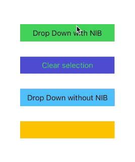

# DSDMenu
— **D**ead **S**impe **D**ropdown **M**enu

A simple drop-down menu written in Swift.

### Features
---
TBD

### Requirements
---
TBD

### Installation
---
TBD

### Usage
---
TBD

### Contributing
---
Contributing is always welcomed, just follow these steps:

1. Fork
2. Create your feature branch (`git checkout -b my-new-feature`)
3. Commit your changes (`git commit -am 'Add some feature'`)
4. Push to the branch (`git push origin my-new-feature`)
5. Create new Pull Request

That's it!

### TODO
---
- [ ] Configure using closure instead of delegate
- [ ] Auto-update view based on selected cell's content, even with orientation changes
- [ ] Use POP for cells instead of subclassing (if possible?)
- [ ] Allow to customize shadow parameters
- [ ] Setup constraints in `updateConstraints()` ([see also])

### Author
---
[m3g0byt3](https://github.com/m3g0byt3)

### License
---
DSDMenu is released under an MIT license. See [LICENSE] for more information.

[//]: #
[LICENSE]: 	<https://github.com/m3g0byt3/dsdmenu/blob/master/LICENSE.txt>
[m3g0byt3]: 	<https://github.com/m3g0byt3>
[See also]: <https://stackoverflow.com/questions/34295577/where-to-add-auto-layout-constraints-code-within-a-custom-uiview>
